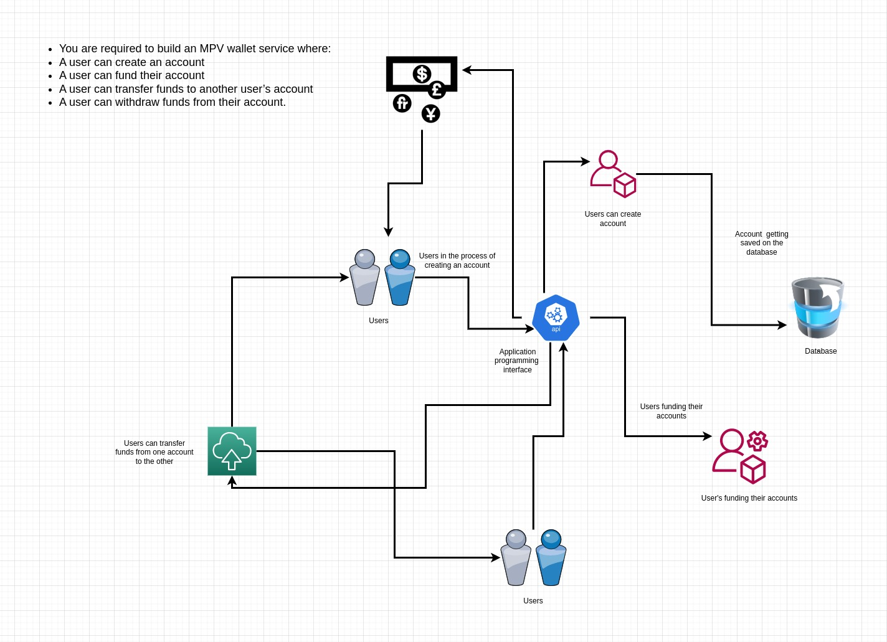
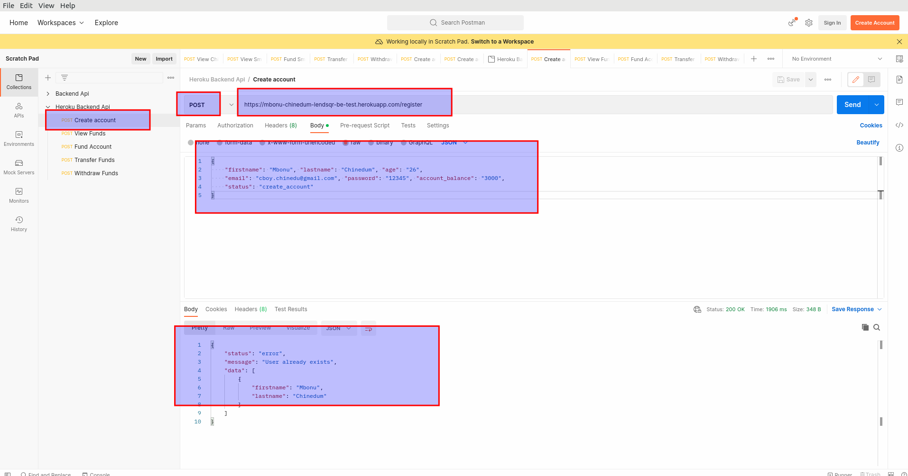
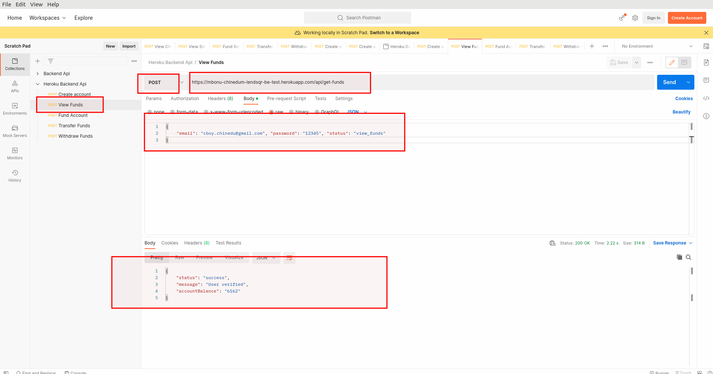
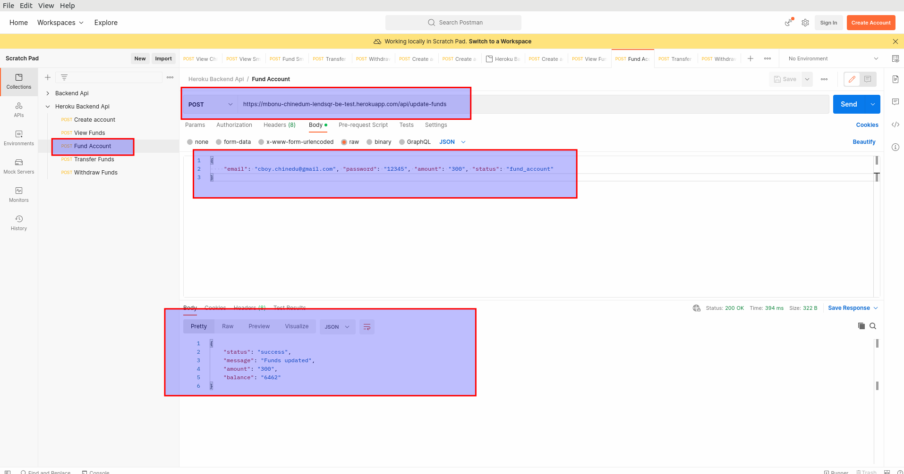

# lendsqr-be-test-backend


<br>

## State Of The Art ""Banking"" Application Programming Interface(API)

<br>

API LINK: https://mbonu-chinedum-lendsqr-be-test.herokuapp.com/


<p align="center"></p>

## Description 

<p> 
At <b> Lendsqr </b>, many of our lenders use our mobile apps to reach over half a million customers. 
<br> 
At this scale, we use <b>NodeJS</b> with <b> TypeScript </b> as its backend software development stack which allows us to rapidly ideate and release features and functionality.

This application sole function is to allow users register, login, perform withdraws, transfer funds and check their respective account balance. 

This application was hosted on the cloud platform heroku, for testing purposes go to the following link provided above. 

The tech stack used to build this application compromises of the following: 

<ul>
    <li> Nodejs </li> 
    <li> sqlite3 </li> 
    <li> morgan </li> 
    <li> expressjs </li> 
</ul>

Also, this application programming interface also has an inbuilt logging function that logs all user activities and transactions. The main purpose of the logging function would be explained later in this section of the readme file. 

In order to use or test this application you would require an application programming interface like postman or curl to perform request which could be <b>POST </b> or <b> GET </b> request to the server hosted on heroku. 

</p>

<br> 

## Problem Statement 

<p> 
The problem statement is as follows: <br> 
You are required to build an MPV wallet service where the following occurs: '

<ul>
    <li> A user can create an account </li> 
    <li> A user can fund their account </li> 
    <li> A user can transfer funds to another user's account </li>
    <li> A user can withdraw funds from their account </li> 
</ul>

So as stated above, inorder to build such an application, you would need a database management system to store the values for each transaction, and log each respective transaction performed by each user using the application. <br> 

you would also need some kind of authentication/validaton system to validate users passwords before giving them access to their respective accounts. 

So to build this robust application programming interface, one need to draft out a block flow diagram explaining the working principle of how this application programming interface should function. 

Below is the diagram explaining how this application works. 

<br> 

 

<br> 


</p>

<br> 

 

## Working Principle 


<p> 
Inorder to understand how this application works, you need to download postman or curl on you desktop or laptop pc and follow the instructions below. <br> 

The first step is to register a user on the application programming interface, and to do that keep on reading this readme file. 

</p>  <br> 

## Register A User 

<br> 

<p>

<b> POST REQUEST:</b> url:  https://mbonu-chinedum-lendsqr-be-test.herokuapp.com/register

<br> 

To register a user access the following link using a <b> POST </b> HTTP request on your 
<b> POSTMAN </b>. And specify the following parameters in a json format which are: 

</p>

```json
{
    "firstname": "your-firstname", 
    "lastname": "your-lastname",
    "age": "your-age",
    "email": "your-email", 
    "password": "your-password", 
    "account_balance": "the-starting-account-balance",
    "status": "create_account"
}

```

<p> <strong> N/B: </strong> Leave the status field as <b> "create_account" </b>, 
when specifying other parameters </p> 

<br> 
<p> The image below explains how to perform a <b> POST </b> request to the register route </p> <br> 

### Click the image below to see it clearly  



<br> <br>

## View User Funds 

<br> 

<p>
<b> POST REQUEST</b> url: https://mbonu-chinedum-lendsqr-be-test.herokuapp.com/api/get-funds

<br> 

To view a registered user account details, access the following link using a <b> POST </b> HTTP request on your <b> POSTMAN </b>. Then specify the following parameters in a json object format which are: <br> 

</p>

```json 
{
    "email": "your-registered-email", 
    "password": "your-password", 
    "status": "view_funds"
}

```

<br>

<p> <strong> N/B: </strong> When specifying the json object file above, leave the status field as <b> "view_funds" </b>. The reason for this is for the application to save the status when logging the transaction for every operation.

<br> 
<p> The image below explains how to perform a <b> POST </b> request to the register route </p> <br> 

### Click the image below to see it clearly  


<br> 

## Fund A User Account 

<br> 

<p> 
<b> POST REQUEST </b> url: https://mbonu-chinedum-lendsqr-be-test.herokuapp.com/api/update-funds 

<br> 

To fund a registered user account, access the following link using a <b> POST </b> HTTP request on your <b> POSTMAN </b> or <b> CURL </b>. Then specify the following paramters as a json object format, and they are: 

</p> 

```json 

{
    "email": "your-email-address", 
    "password": "your-password", 
    "amount": "the-fund-amount", 
    "status": "fund_account"
}

```

<br>

<p> <strong> N/B: </strong> When specifying the json object file above, leave the <b> status </b> field as <b> "fund_account" </b>. The reason for this is for the logging function to log the transaction as a funding transaction. </p>

<br> 
<p> The image below explains how to perform a <b> POST </b> request to fund a user's account with a specified amount value </p> <br> 

### Click on the image below to see it clearly 


## Download And Installation 
<p> 

</p> 


<br> 

## Running the application 
<p> 

</p> 


<br>

## Database (SQLite3) management(Preference) 
<p> 

</p> 


<br>

## Hosting The Application on Heroku 
<p> 


</p>


<br>

## Logging The Transactions And Errors 
<p> 


</p>


<br>

## Help 
<p> 

</p> 


## Authors 
<p> 
    Mbonu Chinedum E
</p> 


## Company 
*  <b> Lendsqr </b> 

### License
* MIT 
* Apache 
* Heroku

<br>

### Acknowledgments
<p>
   All thanks to God Almighty. 
</p>
