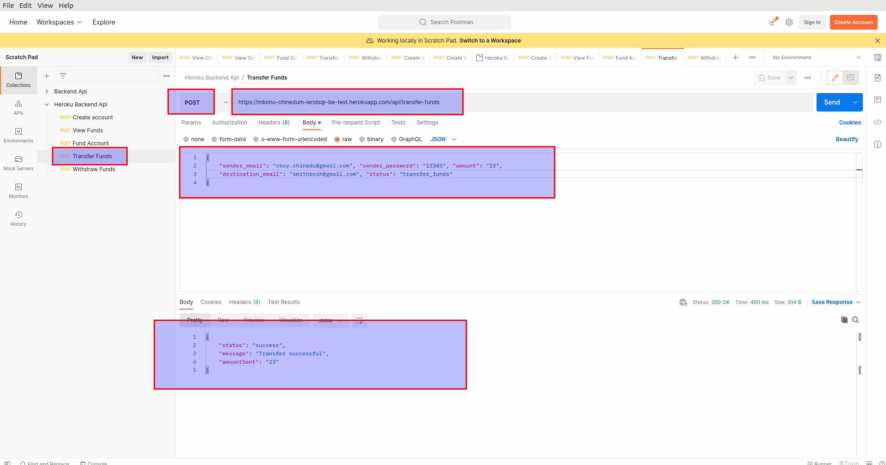

# lendsqr-be-test-backend


<br>

## State Of The Art ""Banking"" Application Programming Interface(API)

<br>

API LINK: https://mbonu-chinedum-lendsqr-be-test.herokuapp.com/


<p align="center"></p>

<p align="center">

</p>

## Description 


<p> 
At <b> Lendsqr </b>, many of our lenders use our mobile apps to reach over half a million customers. 
<br> 
At this scale, we use <b>NodeJS</b> with <b> TypeScript </b> as its backend software development stack which allows us to rapidly ideate and release features and functionality.

This application sole function is to allow users register, login, perform withdraws, transfer funds and check their respective account balance. 

This application was hosted on the cloud platform heroku, for testing purposes go to the following link provided above. 

The tech stack used to build this application compromises of the following: 

<ul>
    <li> Nodejs </li> 
    <li> sqlite3 </li> 
    <li> morgan </li> 
    <li> Jsonweb token (JWT) </li>
    <li> expressjs </li> 
</ul>

Also, this application programming interface also has an inbuilt logging function that logs all user activities and transactions. The main purpose of the logging function would be explained later in this section of the readme file. 

In order to use or test this application you would require an application programming interface like postman or curl to perform request which could be <b>POST </b> or <b> GET </b> request to the server hosted on heroku. 

</p>

<br> 

## Problem Statement 

<p> 
The problem statement is as follows: <br> 
You are required to build an MPV wallet service where the following occurs: '

<ul>
    <li> A user can create an account </li> 
    <li> A user can fund their account </li> 
    <li> A user can transfer funds to another user's account </li>
    <li> A user can withdraw funds from their account </li> 
</ul>

So as stated above, inorder to build such an application, you would need a database management system to store the values for each transaction, and log each respective transaction performed by each user using the application. <br> 

you would also need some kind of authentication/validaton system to validate users passwords before giving them access to their respective accounts. 

So to build this robust application programming interface, one need to draft out a block flow diagram explaining the working principle of how this application programming interface should function. 

Below is the diagram explaining how this application works. 

<br> 

 

<br> 


</p>

<br> 

 

## Working Principle 


<p> 
Inorder to understand how this application works, you need to download postman or curl on you desktop or laptop pc and follow the instructions below. <br> 

The first step is to register a user on the application programming interface, and to do that keep on reading this readme file. 

</p>  <br> 

## Register A User 

<br> 

<p>

<b> POST REQUEST:</b> url:  https://mbonu-chinedum-lendsqr-be-test.herokuapp.com/register

<br> 

To register a user access the following link using a <b> POST </b> HTTP request on your 
<b> POSTMAN </b>. And specify the following parameters in a json format which are: 

</p>

```json
{
    "firstname": "your-firstname", 
    "lastname": "your-lastname",
    "age": "your-age",
    "email": "your-email", 
    "password": "your-password", 
    "account_balance": "the-starting-account-balance",
    "status": "create_account"
}

```

<p> The following parameters could be explained in more details: 
<ul>
<li> The <b>firstname</b>: This is your firstname you want to use when registering the account. </li> 
<li> The <b>lastname</b>: This is your lastname you want to use for registration </li> 
<li> The <b> age </b>: This is the age of the user. </li> 
<li> The <b> password </b>: The password of the user | the password used for creating the account. </li> 
<li> The <b> account_balance </b>: The starting account balance value, this could be 0.00, or 2500. <br> <b>N/B:</b> When specifying the account value, specify the value as numbers, and commas should not be included as values e.g 2,500 is not allowed for the account balance. Use only number and floating point values, <b>Commas are not allowed </b> </li>
<li> The <b> status </b>: This is the instruction given to the logging module telling it that the transaction in progress is a "create_account" transaction. And as such, this section should be left as it is for easy logging and saving the respective transaction. </li> 


</ul>

</p>

<p> <strong> N/B: </strong> Leave the status field as <b> "create_account" </b>, 
when specifying other parameters </p> 

<br> 
<p> The image below explains how to perform a <b> POST </b> request to the register route </p> <br> 

### Click the image below to see it clearly  


<br> <br>

## Login Into The App 

<br> 
<p> 
<b> POST REQUEST</b> url: https://mbonu-chinedum-lendsqr-be-test.herokuapp.com/api/signin

<br> 

To be able signin into the application, access the following link above using a <b> POST </b> HTTP request on your <b> POSTMAN </b>. Then specify the following parameter in a json object format which includes: <br>

</p>

```json 
{
    "email": "your-registered-email", 
    "password": "your-password"
}

```

<p> 
The following parameters could be explained in more details below: 
<ul>
<li> The <b> email </b>: This is the email address you used to register on the register route </li> 
<li> The <b> password </b>: This is the password of the user | the passwod you used during registration </li> 

</ul>

<b> N/B: </b> Take note that the returned json object gives you a <b> token </b> value which could be used for 
further authentication purposes. 

</p>

### Click the image below to see it clearly  


<br> 

## View User Funds 

<br> 

<p>
<b> POST REQUEST</b> url: https://mbonu-chinedum-lendsqr-be-test.herokuapp.com/api/get-funds

<br> 

To view a registered user account details, access the following link using a <b> POST </b> HTTP request on your <b> POSTMAN </b>. Then specify the following parameters in a json object format which are: <br> 

</p>

```json 
{
    "email": "your-registered-email", 
    "password": "your-password", 
    "status": "view_funds"
}

```

<p> The following parameters could be explained in more details below: 
<ul>
<li> The <b> email </b>: This is the email address you used to register on the register route </li> 
<li> The <b> password </b>: This is the password of the user | the password you used during registration </li> 
<li> The <b> status </b> : This is the instruction given to the logging module, telling it that the transaction which is in progress 
is a "view_funds" transaction. And as such, this field should not be changed, it should be left as it is for easy logging and saving of the respective 
transaction values. </li> 
</ul>

</p> 


<br>

<p> <strong> N/B: </strong> When specifying the json object file above, leave the status field as <b> "view_funds" </b>. The reason for this is for the application to save the status when logging the transaction for every operation.

<br> 
<p> The image below explains how to perform a <b> POST </b> request to the register route </p> <br> 

### Click the image below to see it clearly  


<br> 

## Fund A User Account 

<br> 

<p> 
<b> POST REQUEST </b> url: https://mbonu-chinedum-lendsqr-be-test.herokuapp.com/api/update-funds 

<br> 

To fund a registered user account, access the following link using a <b> POST </b> HTTP request on your <b> POSTMAN </b> or <b> CURL </b>. Then specify the following paramters as a json object format, and they are: 

</p> 

```json 

{
    "email": "your-email-address", 
    "password": "your-password", 
    "amount": "the-fund-amount", 
    "status": "fund_account"
}

```

<p> The following parameters could be explained in more details: 
<ul>
<li> The <b> email </b> : This is the email address of the user that wants to fund his account </li> 
<li> The <b> password </b>: This is the password of the user that wants to fund his account </li> 
<li> The <b> amount </b>: This is the amount for which the user want to fund his account with, <b> N/B: </b> the values here must be 
integers or floating point numbers only, values with commas are not accepted by the program e.g 2,500 or N2,408 are not accepted </li> 
<li> The <b> status </b>: This is the instruction given to the logging module telling it that the transaction in progress is a "fund_account" transaction.  
And as such, this section should be left as it is for easy logging and saving the respective transaction values. 
</li> 
</ul>
</p>


<br>

<p> <strong> N/B: </strong> When specifying the json object file above, leave the <b> status </b> field as <b> "fund_account" </b>. The reason for this is for the logging function to log the transaction as a funding transaction. </p>

<br> 
<p> The image below explains how to perform a <b> POST </b> request to fund a user's account with a specified amount value </p> <br> 

### Click on the image below to see it clearly 


<br> 


## Transfer Funds From One Account To Another 

<br> 

<p>
<b> POST REQUEST </b> url: https://mbonu-chinedum-lendsqr-be-test.herokuapp.com/api/transfer-funds 

<br> 

To transfer funds from one user account to another, you need to access the following link above on your <b> POSTMAN </b> or <b> CURL </b> using a <b> POST </b> request by specifying the following parameters in a json format. 
Also note that you need to specify the correct values, e.g the password, the sender email, and the destination email address. <br> 

Failure to specify the correct values would result in an error for the transaction. 
</p>

```json 

{
    "sender_email": "the-email-the-funds-are-leaving", 
    "sender_password": "sender-password", 
    "amount": "the-amount-you-are-sending",
    "destination_email": "the-receiver-email-address", 
    "status": "transfer_funds" 
}

```

<p> The following parameters could be explained in more details; 
<ul>
<li> The <b> sender_email </b>: This is the email address you are sending the money from. <b>N/B:</b> Funds leaves this account. </li> 
<li> The <b> sender_password </b> : This is the password of the sender's account, and the values needs to be correct for a successful transaction. </li>
<li> The <b> amount </b>: This is the amount the sender want to send from his account to the receiver/destination account. <b> N/B:</b> The values specified in this 
section should be integers or floating point numbers. Numbers like 2,500 or N2,345 or $300.00 are not allowed. You can only specify values like e.g 3445, 45500 and so on. </li> 
<li> The <b> destination_email </b>: This is the email address you are sending the money into. A point to take note is that the destination email address 
must be registered on the application/server or it would result into an error. So ensure the destination email value is correct. </li> 
<li> The <b> status </b>: This is the instruction given to the logging module telling it that the transaction in progress is a "transfer_funds" transaction. 
And as such, this section should be left as it si for easy logging and saving the respective transaction. </li> 
</ul>
</p>  

<br> 

<p> <strong> N/B: </strong> When specifying the json object file above, leave the <b> status </b> field as <b> "transfer_funds" </b>. The reason for this is for the loggin function to log the transaction as a transfer of funds transaction. </p>  <br> 

### Click on the image below to see it clearly 


<br>


## Withdraw Fund From An Account 

<br> 
<p> 
<b> POST REQUEST </b> url: https://mbonu-chinedum-lendsqr-be-test.herokuapp.com/api/withdraw-funds

<br>

<p>
To withdraw funds from a specified account, you need to access the following link above on your <b> POSTMAN </b> or <b> CURL </b> using a <b> POST </b> request by specifying the followiing parameters in a json format. <br> 
Also take note that you need to specify the correct values, e.g the password, and the correct email address for the account you want to withdraw funds from. <br> 

Failure to specify the correct values would result in an error for the transaction. 
</p> 

```json 
{
    "email": "your-email-address", 
    "password": "your-password", 
    "amount": "the-amount-you-want-to-withdraw", 
    "status": "withdraw_funds"
}

```


<p>
The following parameters could be explained in more details; 
<ul>
<li> The <b> email </b>: This is the email address you want to withdraw the funds from. Remember, the email must be a registered account on the 
server, if not it could result into errors. </li>
<li> The <b> password </b>: This is the password of the account </li> 
<li> The <b> amount </b>: This is the amount the registered user wants to withdraw from his/her own account. Also take note that the values accepted for the 
amount are integers, and floating point numbers. <b>N/B: </b> Numbers with commas, fullstop, and symbols are not accepted. </li> 
<li> The <b> status </b>: This is the instruction given to the logging module/function telling it that the transaction in progress is a 
"withdraw_funds" transaction. And as such, this section should be left as it is for easy logging and saving the respective transaction. </li> 

</ul>

</p>


<br> 

<p> <strong> N/B: </strong> When specifying the json object file above, leave the <b> status </b> field as <b> "withdraw_funds" </b>. The reason for this is for the logging function to log the transaction as a withdraw of funds. </p> <br> 

### Click on the image below to see it clearly 


<br> 


## Download And Installation 
<p> 
To download this application and use, open a command prompt or terminal and clone a copy of this repo.

</p>

```bash 
    $ git clone "https://github.com/cboychinedu/lendsqr-be-test-backend"
```

<p>
 <br> 
change directory or move into the folder and type the following commands on your command line. 

</p> 

```bash
    $ npm install . 
```

<p>
This command would install all the required dependencies in your working directory. 
<b> N/B: </b> Edit the <b> app.js </b> file and change the <b> PORT </b> and <b> HOST </b>
address to your own port and host address if need be, or run the application locally by using 
"localhost" as HOST, and port 3001 as port number. 


</p> 

```javascript 

    const PORT = process.env.PORT || 3001; 
    const HOST = "localhost"; 

```


<br> 

## Running the application 
<p>
 To run the application, open a terminal in your working directory where the files are located, and in the root folder, type the commands below. 
</p>


```shell
$ npm start  
```

<p> <b> OR </b> </p> 

```shell 
$ node app.js 
```

<p>
 This would start the nodejs application running on "localhost", and port 3001.  

</p>


<br>

## Database (SQLite3) management(Preference) 
<p> 
 <br> 

SQLite is a C-language library that implements a small, fast, self-contained high reliability full-featured <b>SQL</b> database engine. SQLite is the most used database engine in the world. SQLite is build into all mobile phones and most computers and comes bundled inside countless other applications that people use every day. <br> 

The SQLite file format is <b> stable </b>, cross-platform, and backwards compatible and the developers pledge to keep it that way through the year 2050. <br> 
<b> source </b>: <a href="https://www.sqlite.org/index.html"> link </a>

SQLite was designed to allow the program to be operated without installing a database management system or requiring a database administrator. Unlike client–server database management systems, the SQLite engine has no standalone processes with which the application program communicates. 
<b> source: </b>  <a href="https://en.wikipedia.org/wiki/SQLite"> link </a>

</p> 


<br>

## Hosting The Application on Heroku 

<p> From your terminal type the following to host this application on 
heroku </p>

```shell

$ heroku login
$ heroku create 
$ heroku rename <"app-new-name">
$ git add .  
$ git push heroku master 

```


<br>

## Logging The Transactions And Errors 

<p> 
Logging is a process of recording information generated by application activities into log files. Messages saved in the log file are called logs. A log is a single instance recorded in the log file. <br> 

### Wiston 

* Winston provides logging levels. They indicate the log priority, this gives you the ability to sort out critical logs from logs requiring less attention. For example: 

```json 

 {
    "error": 0, 
    "warn": 1, 
    "info": 2, 
    "verbose": 3, 
    "debug": 4, 
    "silly": 5
 }
 
```


<ul>
<li> <b> Error Log One </b>: this displays the amount, the sender email, destination email, 
transfer funds status for a transaction that wasn't successful. 

</li> 
</ul>
</p>

### Click on the image to view this image below 


<p> 
<ul>
<li> <b> Error Log Two </b>: this displays the destination email address, the status of the transaction, and reason 
for failure.  

</li> 
</ul>
</p>

### Click on the image to view this image below 


<p> 
<ul>
<li> <b> General Log 1</b>: this displays the routes logged by the application, and the ip address that visited them. 

</li> 
</ul>
</p>

### Click on the image to view this image below 


<p> 
<ul>
<li> <b> Log Folder </b>: this displays the folder where the log files are saved on the server.  

</li> 
</ul>
</p>

### Click on the image to view this image below 


<p> 
<ul>
<li> <b> Success Log</b>: this displays the log for a successful transaction, with the amount, and the email address.  

</li> 
</ul>
</p>

### Click on the image to view this image below 


<p> 
<ul>
<li> <b>Success Log</b>: this displays the log for a successful transaction, with the amount, and the status of the 
transaction. N/B: The need for the status section.  

</li> 
</ul>
</p>

### Click on the image to view this image below 


<p> 
<ul>
<li> <b> Success Log</b>: this displays the log for a successful transaction, with the service and status for the funds, here the transaction was for funds being withdrawn.   

</li> 
</ul>
</p>

### Click on the image to view this image below 


<p> 
<ul>
<li> <b> Time Log </b>: this displays the log for the time the transaction took place, and was stored on the 
database.  

</li> 
</ul>
</p>

### Click on the image to view this image below 


<br>

## Help 
<p>
Contact me for references and additional information. 

<ul>
    <li> <b> Email:</b> cmbonu@protonmail.com </li> 
    <li> <b>Number:</b> +234-7081-528827 </li>
    <li> <b> Number: </b> +234-9030-045587 </li> 
</ul>
</p>
<br> 


## Authors 
<p> 
    Mbonu Chinedum E
</p> 


## Company 
*  <b> Lendsqr </b> 

### License
* MIT 
* Apache 
* Heroku

<br>

### Acknowledgments
<p>
   All thanks to God Almighty. 
</p>
