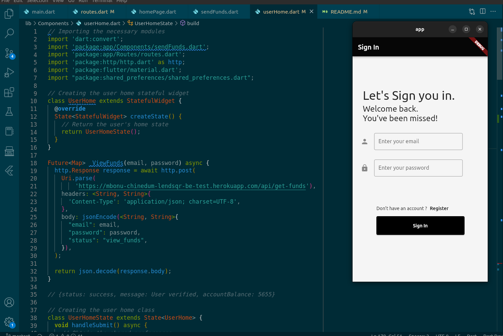
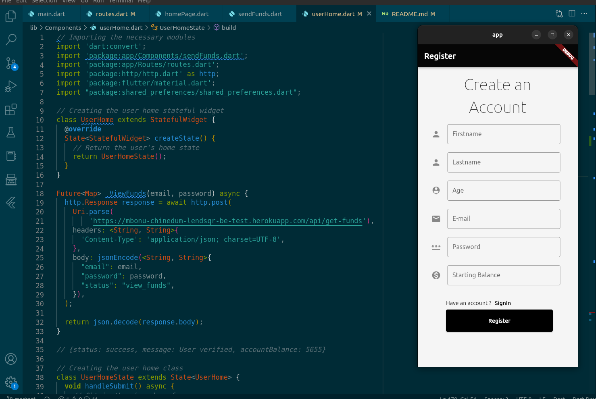
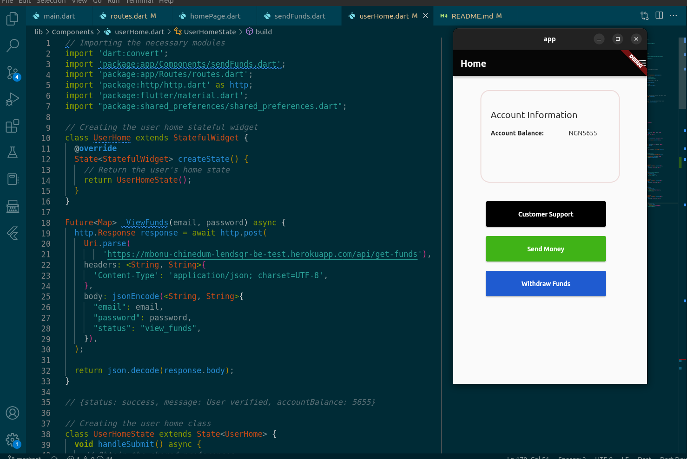

# Lendsql Mobile App 

<b> Download Link: </b> <a href="https://mbonu-chinedum-lendsqr-be-test.herokuapp.com/download"> link </a>
<p>
This is the mobile application section. Below are the images for the respective routes. 
</p>

<p align="center">

<br> <br>


<br> <br> 



<br> <br> 
<p>
To enable internect connection, <br> 
open the AndroidManifest.xml file located at ./android/app/src/main and add the following line:

</p>

```html 
<manifest xmlns:android="...">
  <uses-permission android:name="android.permission.INTERNET"/>
</manifest>

```